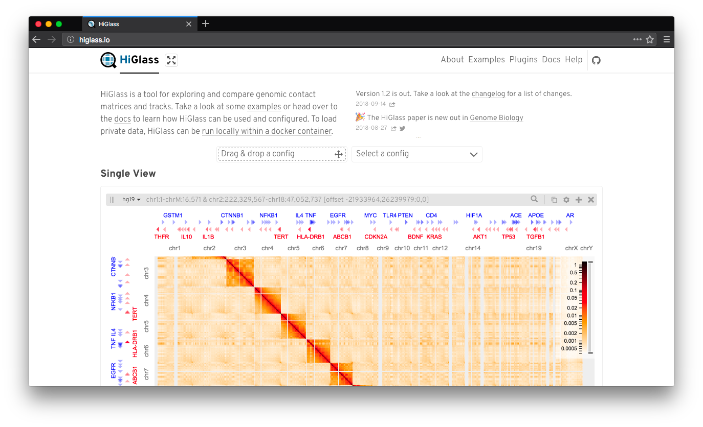

# HiGlass App

[](http://higlass.io)
[](https://www.npmjs.com/package/higlass-app)
[](https://travis-ci.org/higlass/higlass-app)
[](https://github.com/prettier/prettier)



> The web application for viewing, exploring, and annotating 1D and 2D genomic data.

HiGlass App is used to run https://higlass.io but you can also use it as the starting point for building your own application around HiGlass. For example, it is used in [Novartis' Peax](https://github.com/Novartis/peax) as the frontend application.

**URL**: https://higlass.io

**Help**: http://bit.ly/higlass-slack

**Note**: This is the source code for the web application only! You might want to check out the following repositories as well:

- HiGlass viewer: https://github.com/higlass/higlass
- HiGlass server: https://github.com/higlass/higlass-server
- HiGlass docker: https://github.com/higlass/higlass-docker
- HiGlass manage: https://github.com/higlass/higlass-manage

## Install

```bash
npm install --save higlass-app
```

## Development

```bash
git clone https://github.com/higlass/higlass-app && higlass-app
npm install
```

### Commands

**Developmental server**: `npm start`

**Production build**: `npm run build`

**Autoformat JS code**: `npm run fix`

### Configuration

HiGlass App can be configured at build and run time using [`config.json`](config.json) and [`public/config.js`](public/config.js) respectively.

[`config.json`](config.json) contains the default configuration. For adjustments, copy it to `config.dev.json`, `config.prod.json`, or `config.local.json`. `dev` is used in developmental mode, `prod` is picked up in production, and `local` can be used for local testing. The config is overwritten in the following order: _default_, dev, prod, local.

Additionally some settings can be overwritten at run time using [`public/config.js`](public/config.js). For details please see the table below:

| Name                 | Description                                                                                                                                     | Type                 | Default                                   | config.js name               | Configurable via `config.js` only |
| -------------------- | ----------------------------------------------------------------------------------------------------------------------------------------------- | -------------------- | ----------------------------------------- | ---------------------------- | --------------------------------- |
| homepageDemos        | If set to `true` the start page will feature some demo views.                                                                                   | `boolean`            | `false`                                   | HGAC_HOMEPAGE_DEMOS          | no                                |
| server               | Define the default higlass server from which view config are loaded by default.                                                                 | `string`             | `''` (same host, same port)               | HGAC_SERVER                  | no                                |
| basepath             | The base path under which higlass-app will run, e.g., if you set it to `/cool` higlass-app will be available at `https://your-server.com/cool`. | `string`             | `''` (root)                               | HGAC_BASEPATH                | no                                |
| defaultOptions       | Default options that are being passed to `hglib`.                                                                                               | `object`             | _none_                                    | HGAC_DEFAULT_OPTIONS         | no                                |
| defaultViewConfig    | Default view config to load. This can either be a uuid or an actual view config. By default, the default view config has the uuid `default`.    | `object` or `string` | _none_ (internally defaults to `default`) | HGAC_DEFAULT_VIEW_CONFIG     | no                                |
| runByOrganization    | Name of the organization running the HiGlass instance.                                                                                          | `string`             | _none_                                    | HGAC_RUN_BY_ORGANIZATION     | yes                               |
| runByOrganizationURL | Optional URL pointing to the host organization's website.                                                                                       | `string`             | _none_                                    | HGAC_RUN_BY_ORGANIZATION_URL | yes                               |
| runBySlogan          | Slogan to advertise the host organization.                                                                                                      | `string`             | `Run by`                                  | HGAC_RUN_BY_SLOGAN           | yes                               |
| runByLogoURL         | URL pointing to the host organization's logo.                                                                                                   | `string`             | _none_                                    | HGAC_RUN_BY_LOGO_URL         | yes                               |
| runByLogoOnly        | If `true` the footer will only show a logo. Useful when the logo contains the organization name. By default this is `false`.                    | `boolean`            | `false`                                   | HGAC_RUN_BY_LOGO_ONLY        | yes                               |
| runByContactURL      | URL or mailto link to get in touch with the hosting organization.                                                                               | `string`             | _none_                                    | HGAC_RUN_BY_CONTACT_URL      | yes                               |

### Folder Structure

HiGlass App is based on [react-create-app](https://github.com/facebookincubator/create-react-app) and implements the following folder structure:

- **[`/build`](build)** [_Do not edit._]

  Contains the build files.

- **[`/config`](config)**

  Contains the build configs for webpack and converting Markdown into JSX. Except the JSX, the files are derived from [react-create-app](https://github.com/facebookincubator/create-react-app).

- **[`/node_modules`](node_modules)** [_Do not edit._]

  Contains thrid party libraries.

- **[`/public`](public)**

  Contains the public _index_ files of HiGlassApp.

- **[`/scripts`](scripts)**

  Contains node scripts for webpack and converting Markdown into JSX. Except the JSX, the files are derived from [react-create-app](https://github.com/facebookincubator/create-react-app).

- **[`/src`](src)**

  Entry point for the application source.

  - **[`/actions`](actions)**

    Flat folder containing Redux actions. All actions should be exported in the [`index.js`](src/actions/index.js).

  - **[`/components`](components)**

    Flat folder containing _presentational_ components. See [Dan's article](https://medium.com/@dan_abramov/smart-and-dumb-components-7ca2f9a7c7d0) for a comparison between presentational and container components.

  - **[`/configs`](configs)**

    Flat folder containing config files. Configs should host all constant variables.

  - **[`/containers`](containers)**

    Flat folder containing _container_ components. See [Dan's article](https://medium.com/@dan_abramov/smart-and-dumb-components-7ca2f9a7c7d0) for a comparison between presentational and container components.

  - **[`/factories`](factories)**

    Flat folder containing factory functions. See [Eric's article](https://medium.com/javascript-scene/javascript-factory-functions-with-es6-4d224591a8b1) for an introduction to factory functions.

* **[`/hocs`](hocs)**

  Flat folder containing _higher-order_ components. See the [React docs](https://reactjs.org/docs/higher-order-components.html) for an introduction.

* **[`/images`](images)**

  Flat folder containing images.

* **[`/reducers`](reducers)**

  Flat folder containing [Redux](https://github.com/reduxjs/redux) reducers.

* **[`/styles`](styles)**

  Flat folder containing generic style components. Note: this is kind of arbitrary but I like to separate reusable CSS classes from [`index.scss`](src/index.scss) such that I can quickly drop them into other apps.

* **[`/utils`](utils)**

  Flat folder containing utility functions. (Utility function **must** be pure and should not have any state or side effects!)

* **[`/views`](views)**

  Flat folder containing all view components. (View components are just like presentational components with the only difference that they are associated to a specific URL. This separation is again arbitrary but I like having all views separated as I consider them **uncomposable**. Only [`Main`](src/components/Main.js) should import views.)
